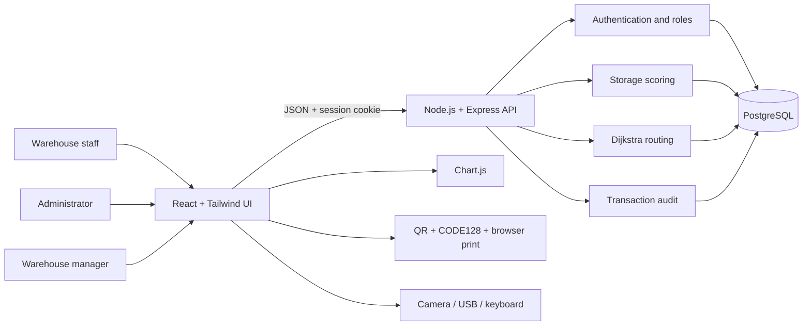
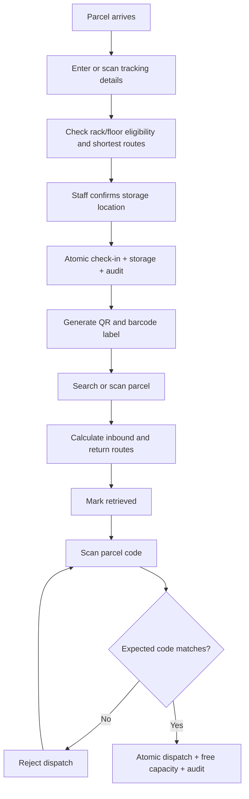
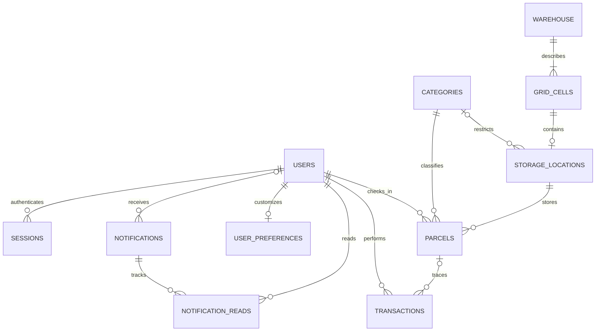

# Architecture and operation flow

Warehouse is a singleton; every grid cell belongs to that one warehouse. Parcel records retain the last storage location after dispatch for historical traceability. Occupancy is calculated from nondispatched parcel quantities and sizes rather than maintained as a second mutable counter.

The default layout has one Warehouse Access Point configured for Receiving + Dispatch. Grid cells describe both physical layout and inventory. Active/walkable flags, movement costs, and direction restrictions define the current routing graph. Floor storage is configurable as walkable or nonwalkable. Retrieval and return paths run through independent Dijkstra calculations; occupied locations require both paths before a layout can be saved.

For current hosting, nightly cloud copies, layering and engineering tradeoffs, see the [engineering handbook](../engineering/README.md). The diagrams above summarize domain relationships; exact keys and nullability are defined by the base schema plus migrations.
