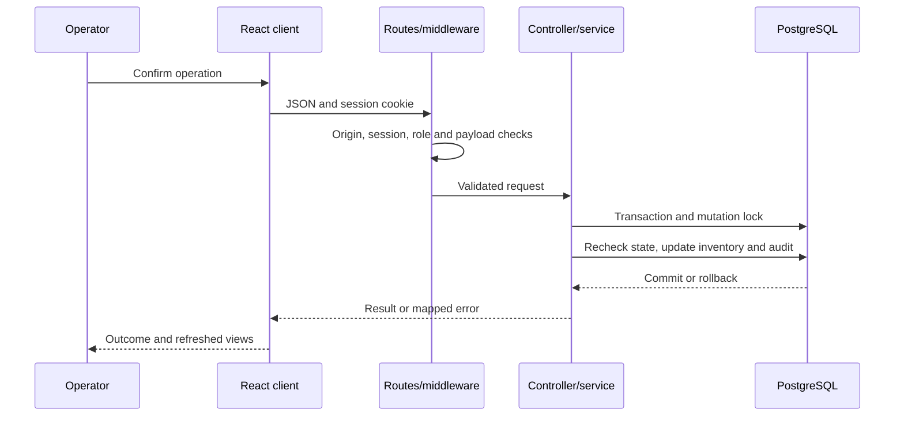
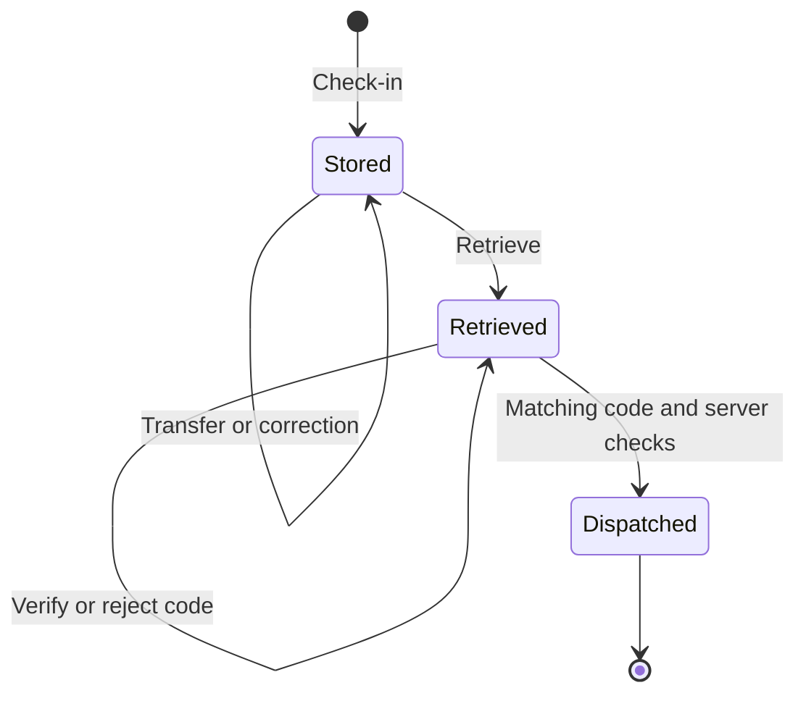
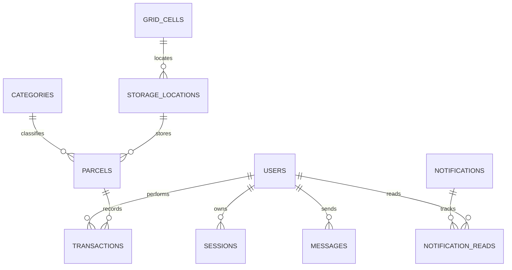

# Software engineering handbook

Implementation reference, tradeoffs and operator responsibilities. This guide does not assert certification or exhaustive verification. See [README](../../README.md), [files](files.md), [API](../api/README.md) and [recovery](../operations/recovery.md).

## Requirements engineering and traceability

Actors: staff, managers, administrators, deployment operators and the backup runner. PostgreSQL is authoritative inventory state. Browser drafts are provisional input. The backup is a snapshot rather than a second writable warehouse. Cameras, scanners, printers, networks and providers are environment dependencies.

| Acceptance condition                               | Implementation                            | Verification                       |
| -------------------------------------------------- | ----------------------------------------- | ---------------------------------- |
| Eligible accounts only; role restrictions          | Auth/role middleware and client guards    | Authentication/permission tests    |
| No overfill during concurrent receiving            | Compatibility and atomic parcel mutations | Capacity/concurrent check-in tests |
| Traceable movements/corrections                    | Parcel/transaction models and audit       | Transfer/correction tests          |
| Reachable storage and return route                 | Graph, Dijkstra and pathfinding           | Routing/layout tests               |
| Wrong codes cannot release stock                   | Verify/dispatch service checks            | Verification/dispatch tests        |
| Stale edits cannot overwrite newer layout          | Revision checks                           | Stale-revision tests               |
| Draft restore does not commit inventory            | useDraft and page handlers                | Recovery browser tests             |
| Backup preserves primary and validates destination | Backup service/workflow                   | Backup/failure/restore test        |
| Persistent authenticated messaging                 | Message routes, indexes/read cursors      | API/browser messaging tests        |

Functional scope covers warehouse operations and team/configuration administration. Nonfunctional priorities are integrity, traceability, access control, usability, recoverability and maintainability. Numeric latency, throughput, recovery and availability targets need stakeholder agreement and measurement. Payments, procurement, shipping-provider integration and robot control are outside scope.

## Architecture and design

Routes define HTTP contracts; controllers adapt requests; services implement operations; models query persistence; algorithms compute compatibility/routes. Recovery/messaging have direct database handlers in routes. Extracting them is a maintenance opportunity, not an existing strict separation guarantee.

The persistent entry initializes before listening. The Vercel adapter caches initialization per warm instance and resets a failed promise for later retry, then delegates to Express. There is no business queue or independently deployed service layer.

| Decision                            | Benefit                               | Tradeoff                                      |
| ----------------------------------- | ------------------------------------- | --------------------------------------------- |
| PostgreSQL constraints/transactions | Durable consistent references/writes  | Migration/privilege management                |
| Shared advisory mutation lock       | Serializes capacity, codes and audits | Write contention; keep long work outside lock |
| Revision-based edits                | Prevents stale overwrite              | Reload/reconciliation required                |
| Cookie sessions in PostgreSQL       | Revocation across instances           | Primary outage affects administration         |
| Weighted directed routing           | Costs/directions represented          | Steps are not measured distance               |
| Polling                             | Simple serverless updates             | Query load and freshness delay                |
| Nightly dump/restore                | Verified separate recovery copy       | Snapshot age and manual cutover               |

## Frontend engineering and human factors

React StrictMode mounts the app. AuthContext owns account/session state; AppearanceContext handles theme/font. Pages are lazy-loaded and compose reusable common, parcel, warehouse, QR, chart and layout/chat views. Client guards control navigation but backend permissions secure operations. HTTP clients use same-origin cookies and session-expiry handling. useApi handles fetching/polling; scanner, drafts and warehouse gestures have dedicated hooks.

Drafts are localStorage records scoped by user/form, versioned, debounced and expiring after seven days. Restore/discard is explicit. They do not create transactions or synchronize across devices. Dispatch drafts preserve selection only, requiring fresh route/state/code verification. Browser storage failures are surfaced.

Responsive navigation, labeled fields, readable themes and print styling support usability. Test keyboard/focus behavior, contrast, mobile browsers and real hardware with users. No completed WCAG/accessibility audit is claimed.

## Domain model and algorithms

Stored/Retrieved records consume quantity, size units and weight; Dispatched records retain history but release storage. Corrections require a reason and before/after auditing. Business codes differ from numeric row IDs.

Measured size classification uses configured thresholds. Physical fit allows horizontal rotation and upright height, not volumetric packing. Quantity, units, weight, category, cell/location state, floor policy and accessibility determine eligibility.

buildGraph creates accessible vertices and directed cardinal edges using costs/directions. Dijkstra minimizes weighted cost. Do not assume a heap-based complexity bound: consult its actual array/selection implementation. Walkable storage is visited directly; otherwise a reachable adjacent pickup cell is used. Receiving/dispatch door roles determine endpoints and separate return routes.

Recommendations filter compatibility/reachability and sort racks before floor, then inbound cost, utilization and code. The returned numeric score is supplemental. Writes recheck eligibility because capacity/layout can change between selection and submission.

## Relational design and migrations

The current schema is schema.sql plus ordered migrations. Initialization applies tracked changes transactionally and records schema_migrations. Seeds initialize fresh warehouses without resetting existing inventory.

| Tables                                                 | Responsibility                                                                   |
| ------------------------------------------------------ | -------------------------------------------------------------------------------- |
| users, sessions                                        | Identity, roles, password/token hashes, profile/presence/deletion and expiration |
| categories                                             | Parcel categories and storage restrictions                                       |
| warehouse, grid_cells                                  | Singleton warehouse revision, geometry and movement/access points                |
| storage_locations                                      | Physical rack/floor limits, capacity and cell/category links                     |
| parcels                                                | Codes/tracking, measurements, quantity, status and location                      |
| transactions, counters                                 | Audit history and readable code generation                                       |
| system_settings, user_preferences                      | Versioned policies/classification and appearance                                 |
| notifications, notification_reads, storage_alert_state | Events, user read state and capacity transitions                                 |
| profile_image_requests                                 | Pending images and review outcomes                                               |
| database_backups                                       | Status, checksum, size and synchronization metadata                              |
| messages, message_reads, message_typing                | History, read cursors and typing expiration                                      |
| schema_migrations                                      | Applied change ledger                                                            |

This is a summary; exact nullability/keys are in schema/migrations. Occupancy is derived, not editable source state. Unique constraints/FKs protect identity/history. Several timestamps use ISO text and metadata serialized JSON: preserve format. Account removal is permanent logical deletion, retaining historical references.

## Security engineering

Passwords use salted scrypt and timing-safe comparison. Random session tokens are stored as SHA-256 hashes. Cookies are HttpOnly, SameSite=Strict, eight-hour and Secure in production. Login is rate-limited; authentication rejects expired, inactive, suspended and deleted identities. Security-relevant account changes revoke sessions.

Helmet supplies headers/CSP. JSON is bounded and Zod validates payloads. Mutations with Origin headers are checked against configured/same-origin values; this is the implemented defense, not full CSRF audit coverage. Queries parameterize values and validate dynamic schema identifiers. Never embed credentials in client bundles.

Images have format/size/dimension checks and are decoded/re-encoded into normalized WEBP. Ordinary users submit review requests; administrators update their own images immediately. Managers/admins review requests. Messages are application data rather than raw HTML.

Review stolen credentials, privilege escalation, identifier tampering, cross-site requests, hostile images, duplicate writes, exposed dumps, destination mistakes and dependencies. Use provider/repository secret stores, dedicated credentials and permission review. Formal penetration testing is not claimed.

## Quality assurance

| Layer                 | Source                            | Evidence                                                                        |
| --------------------- | --------------------------------- | ------------------------------------------------------------------------------- |
| Algorithms            | tests/pathfinding/routing.test.js | Costs, blocked paths, floor access, capacity/connections                        |
| HA helpers            | tests/pathfinding/ha.test.js      | Read-only monitor interpretation and safe availability                          |
| API integration       | tests/backend/api.test.js         | Real sessions, roles, concurrency, transitions, migrations, recovery, messaging |
| Workflows             | tests/frontend/workflows.spec.js  | Receiving/dispatch, labels, admin/navigation/settings                           |
| Recovery UI           | tests/frontend/recovery.spec.js   | Drafts, fresh verification, profiles/presence/monitoring                        |
| Presentation/scanning | storix.spec.js, scanner.spec.js   | Chat, routes, themes, deletion, scanner lifecycle                               |
| Deployed opt-in       | tests/frontend/deployed.spec.js   | Explicit target and private credentials                                         |

Normal tests isolate a random schema and remove it in finally. Recovery tests create/drop a separate random database and need corresponding privileges. Deployed tests bypass schema isolation and perform real writes: use a designated test deployment.

Tests should assert business behavior. Dispatch recovery restores selection, clears scanned input, disables confirmation until fresh verification, and clears the draft after completion. Reproduce defects, identify invariants and run appropriate checks. Passed tests establish their covered scenarios rather than exhaustive correctness.

## Configuration management and CI/CD

Version source, lockfile, schema changes, docs and workflows. Ignore dependencies, dist, private environments, dumps/logs and test artifacts. npm ci uses exact lockfile resolution. Keep local/cloud configuration separate.

CI uses Node 24/PostgreSQL 18 with matching clients, backend tests, build and browser checks. Vercel builds static assets and the API adapter. A push is not proof of completed deployment: inspect status and smoke-test HTML/assets/API. Health liveness is not full business readiness.

Review contracts, permissions, UI, migrations, tests and docs together. Test structural changes on a disposable copy, take a recovery copy, plan compatibility/rollback or forward repair, deploy and validate. Whole-database restore can erase newer valid work and is not ordinary migration rollback.

## Operations and reliability

Transactions provide business traceability; backup metadata and provider logs record execution. Avoid logging credentials, image data and SQL dumps. No centralized tracing/SIEM deployment is asserted.

Nightly GitHub copies use separate direct Neon connections, validate dumps, restore the dedicated target transactionally, verify tables, clear copied sessions and record synchronization. Runner files are ephemeral; retained archives require separate storage. GitHub concurrency does not coordinate external Windows/VPS workers.

Recovery point is the last successful snapshot: approximately one nightly interval plus delays/failures can be exposed. Recovery time depends on size/network/restore/validation/cutover and has not been measured. Primary outage can block authenticated monitoring. Promotion requires inventory/role/route checks and deliberate connection changes.

Optional HA monitors inspect externally provisioned fenced infrastructure. The application does not install replication or promote its backup. HA_DATABASE_URL is a supplied writer endpoint, not two simultaneously writable copies.

## Maintenance and change discipline

1. Agree on acceptance criteria, latency/availability goals, retention and incident ownership.
2. Measure polling/query cost, graph runtime, bundle size and lock contention before scaling.
3. Add indexes/pagination and structural changes based on measured load.
4. Practice recovery and supply independent encrypted archive retention when required.
5. Review roles, accessibility, browser/hardware support and dependencies regularly.
6. Update API, Postman, migration/file guides and acceptance tests with features.

These are future engineering tasks, not implicitly implemented capabilities.

## Configuration reference

Configuration is read on process startup. Change the correct hosting environment and restart/redeploy; changing a local file does not update Vercel or GitHub secrets.

| Variable                                   | Meaning / default                                                               |
| ------------------------------------------ | ------------------------------------------------------------------------------- |
| DATABASE_URL                               | Required operational PostgreSQL connection                                      |
| DATABASE_URL_UNPOOLED                      | Optional direct connection for initialization/backups                           |
| HA_DATABASE_URL                            | Optional externally fenced writer endpoint; overrides normal connections        |
| DB_SCHEMA                                  | Validated application schema; defaults to public                                |
| HOST / PORT                                | Persistent listening address; defaults 127.0.0.1 / 3001                         |
| APP_ORIGIN                                 | Browser origin accepted by mutation checks; local default http://localhost:5173 |
| NODE_ENV                                   | production enables secure cookies and production behavior                       |
| SEED_DEMO                                  | Demo parcels enabled unless false; applies to fresh initialization              |
| ADMIN_PASSWORD / STAFF_PASSWORD            | First-time starter credentials only                                             |
| BACKUP_DATABASE_URL                        | Separate recovery destination                                                   |
| EMERGENCY_DATABASE_URL                     | Legacy destination alias; backup URL takes precedence                           |
| BACKUP_DIRECTORY                           | Restricted dump/manifest directory; default .local/backups                      |
| BACKUP_INTERVAL_HOURS                      | Legacy in-process interval; 0 disables; worker accepts 1?168                    |
| BACKUP_WARNING_HOURS                       | Successful-copy freshness threshold; code default 6, nightly recommendation 30  |
| PG_DUMP_PATH / PG_RESTORE_PATH / PSQL_PATH | Client executable overrides                                                     |
| PRESENCE_IDLE_MINUTES                      | Idle threshold, default 5, bounded 1?60                                         |
| PRESENCE_OFFLINE_MINUTES                   | Offline threshold, default 30; constrained above idle                           |
| HA_NODE_A_URL / HA_NODE_B_URL              | Optional external read-only monitor URLs                                        |
| HA_NODE_A_NAME / HA_NODE_B_NAME            | Optional monitor display names                                                  |
| HA_MONITOR_USER / HA_MONITOR_PASSWORD      | Private external monitor credentials                                            |
| VERCEL                                     | Platform marker; disables persistent/local backup execution                     |

GitHub secret names WSRMS_PRIMARY_DATABASE_URL and WSRMS_BACKUP_DATABASE_URL map to the ordinary connection variables only inside the nightly job. The workflow fixes DB_SCHEMA=public. Custom-schema deployments require an explicit reviewed workflow change. Test-only settings include API_PORT/UI_PRODUCTION, DEPLOYED_BASE_URL and private deployed account credentials; consult the test/config source before invoking them.

## Troubleshooting and incident handling

| Symptom                                     | Investigate                                                                   | Safe next step                                                       |
| ------------------------------------------- | ----------------------------------------------------------------------------- | -------------------------------------------------------------------- |
| Startup/database 503                        | Connection configuration, direct endpoint, privileges, provider availability  | Correct configuration; do not reset operational data                 |
| 401 after an account update                 | Revoked/expired session or inactive account                                   | Sign in again after verifying eligibility                            |
| 403 on management action                    | Role and server origin                                                        | Check account/route contract rather than bypassing middleware        |
| 409 layout/settings save                    | Stale revision                                                                | Reload and reconcile changes                                         |
| No recommendations                          | Measurements, all capacity limits, category/floor policy and round-trip route | Correct warehouse configuration or choose genuinely eligible storage |
| Camera unavailable                          | HTTPS/localhost, permission, device lifecycle                                 | Test browser/device and manual/keyboard scan path                    |
| Failed backup                               | Job/manifest status, tools/version, source/target reachability and lock       | Investigate before retry; do not silently clear uncertain locks      |
| Backup warning after successful nightly job | Vercel freshness threshold still six hours                                    | Set 30-hour threshold in production and redeploy                     |
| Hosted restore unavailable                  | Serverless host has no retained archive/tools                                 | Use the documented persistent recovery host/runbook                  |

For incidents, preserve logs and audit evidence, identify affected records/operations, establish whether the source or copy is authoritative, contain the failure, validate a repair/recovery, communicate impact and record a post-incident prevention task. Never infer safe mutation retry solely from a missing client response.

## Engineering discipline coverage

| Discipline               | Repository application                                                         |
| ------------------------ | ------------------------------------------------------------------------------ |
| Requirements             | Actor/workflow scope, acceptance criteria and traceability table               |
| Design                   | Context, layers, sequence/state/relationship diagrams and tradeoffs            |
| Construction             | Modules, validation, reusable components, transaction invariants               |
| Data engineering         | Relational constraints, derived state, versioned migrations and seeds          |
| Quality assurance        | Integration/algorithm/browser verification and reproduction-driven fixes       |
| Security                 | Authentication, authorization, input/origin/image controls and secret handling |
| Configuration management | Git, lockfiles, environment separation and reviewed changes                    |
| Delivery/operations      | CI, Vercel promotion checks, scheduled jobs and runbooks                       |
| Reliability              | Failure mapping, recovery snapshots and explicit recovery limits               |
| Human factors            | Responsive views, drafts, readable errors and device/accessibility validation  |
| Maintenance              | Change impact analysis, docs/test updates and measured improvements            |

Project management artifacts such as signed requirements, estimates, release commitments, risk ownership and stakeholder approvals are not invented here. Create them for the actual organization/project when needed.
